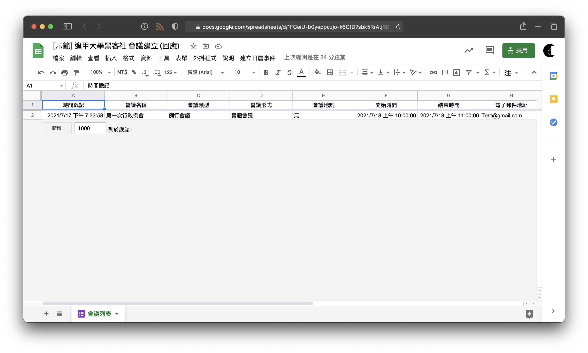

# HackerSir X MeetCreate

使用者填完標單後，自動在行事曆上生成事件，並且在 Line Notify 和 Discord 上公告。

## 功能
- 自動在 Google Calendar 生成一個會議事件。
- 自動在 Line Notify 和 Discord 公告會議訊息。

## 使用方法
1. 首先，建立會議表單（格式請參考：https://forms.gle/kN1mf7z5N8u3bXkVA）。  
  
2. 從表單中生成 Google Sheet，並將工作表命名為「會議列表」。
   
   因程式是抓取表單中的相對位置，所以請確保格式與[此試算表](https://docs.google.com/spreadsheets/d/1FGeiU-b0yeppczjo-k6CtD7sbk5RrAtjRByIYUzvPe4/edit?usp=sharing)相同。

   > 若自定義「工作表名稱」，需修改 `main.gs` 中 
   > ```javascript=
   > var sheet_List = Meet.getSheetByName('會議列表');
   > ```

3. 選擇試算表中「工具」的「指令碼編輯器」，並將 `main.gs` 和 `config.js` 複製進去並存檔。

4. 修改 config.js。

    ```js=    
    // Line Notify 、 Discord Webhook
    LineNotifyToken = 'YOUR_LINENOTIFY_TOKEN';
    DiscordWebhookToken = 'YOUR_DISCORD_WEBHOOK_TOKEN';

    // Google Sheet 會議列表
    GoogleSheetId_Meetlist = 'YOUR_MEET_SHEET_Id';
    // Google Sheet 通訊錄
    GoogleSheetId_Contactlist = 'YOUR_CONTACT_SHEET_Id';

    // Google Calendar
    GoogleCalendarId = 'YOUR_CALENDAR_Id';
    ```
    
5. 選擇「觸發條件」點選「新增觸發條件」。

    | 執行的功能 | 部署作業 | 活動來源 | 時間型觸發條件類型 |
    | :-------------: | :--------------: | :---------: | :----------------: |
    | onOpen        | 上端 | 試算表 | 文件開始時 |
    | addEvents  | 上端 | 試算表 | 提交表單時  | 

## DEMO
- Google 表單


- Google 試算表



- Google 行事曆


- Discord


- Line Notify


